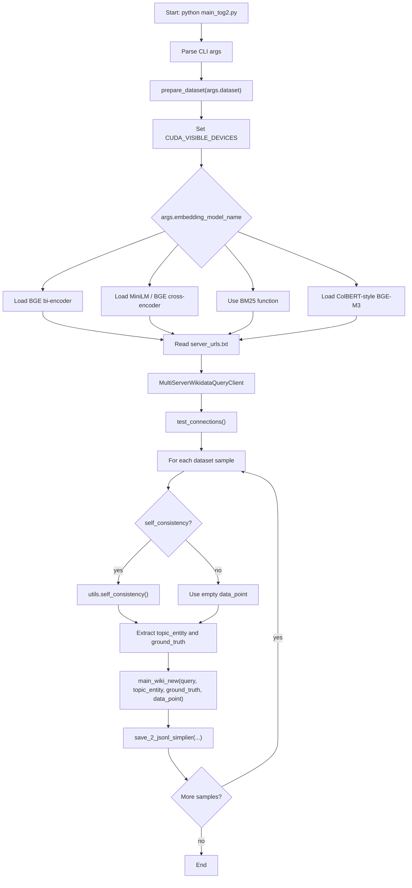
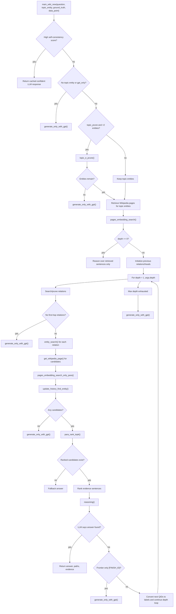
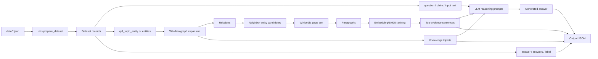
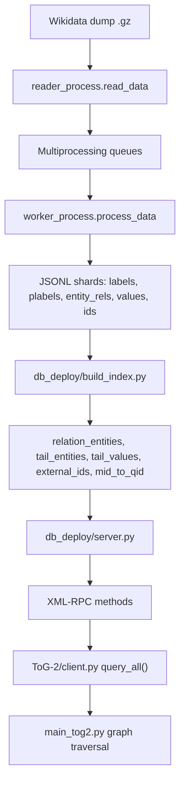
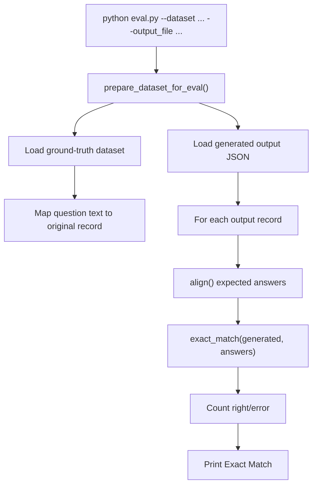

# Execution Flow

The main execution flow starts in `TOG_Original/ToG-2/main_tog2.py`. It is a script-style entry point: argument parsing, dataset/model/client setup, and the per-sample loop execute at module top level.

## Main CLI Flow

## Per-Question ToG-2 Flow

`main_wiki_new` is the core pipeline function.

## Data Flow

## Wikidata Service Flow

The runtime client expects XML-RPC servers created from preprocessed Wikidata data.

## Evaluation Flow

## Important Runtime Branches

- `--self_consistency True`: runs 10 sampled LLM completions before graph search and may skip ToG traversal when agreement is at or above `--self_consistency_threshold`.
- `--gpt_only True`: bypasses graph traversal and calls `generate_only_with_gpt`.
- `--depth 0`: retrieves topic-entity Wikipedia evidence but does not expand graph relations.
- `--relation_prune True`: asks the LLM to select promising relations before expanding entities.
- `--relation_prune_combination True`: prunes relations jointly across current frontier entities.
- `--topic_prune True`: prunes initial topic entities when more than two are available.
- `--embedding_model_name`: controls whether evidence ranking uses BGE, MiniLM, BM25, BGE reranker, or ColBERT-style scoring.

