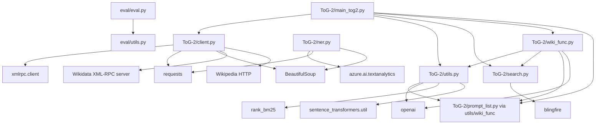
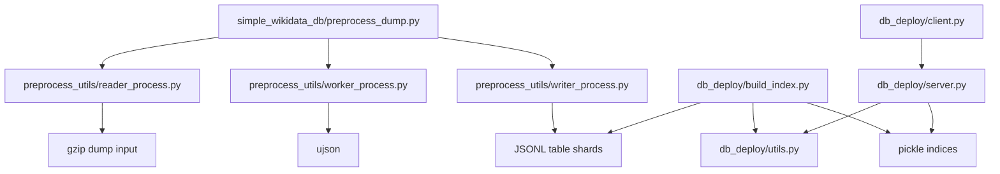
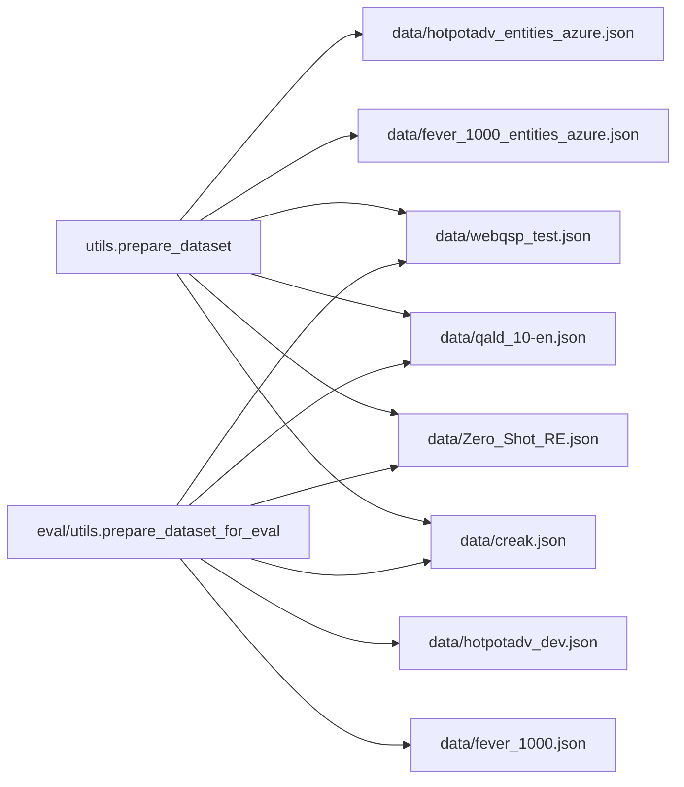
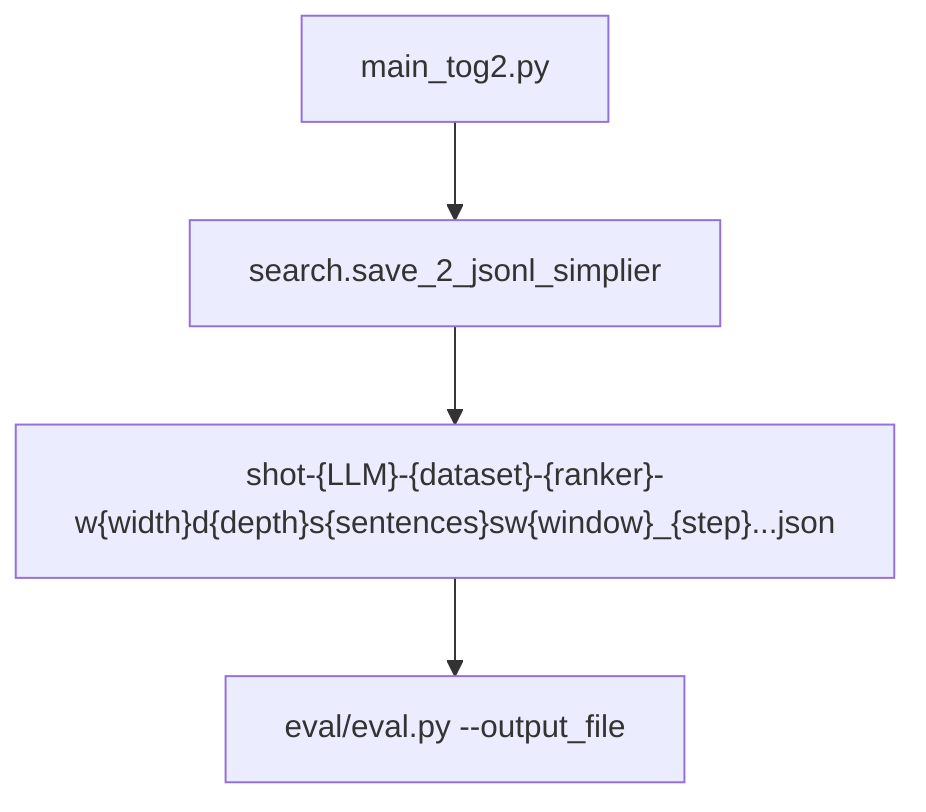

# File Dependency

This document maps source-file dependencies and runtime relationships in `TOG_Original/`.

## Module Dependency Diagram

## Wikidata Tooling Dependencies

## Main Runtime Files

| File | Imports / Depends On | Used By | Role |
|---|---|---|---|
| `ToG-2/main_tog2.py` | `client`, `utils`, `search`, `wiki_func`, `urllib3`, `torch`, optional ranking model packages | User CLI | Main ToG-2 runner and per-sample orchestrator. |
| `ToG-2/client.py` | `xmlrpc.client`, `requests`, `BeautifulSoup`, `ThreadPoolExecutor` | `main_tog2.py`, `wiki_func.py` through `wiki_client` object | Talks to Wikidata XML-RPC servers and fetches Wikipedia page text. |
| `ToG-2/utils.py` | `prompt_list`, `openai`, `rank_bm25`, `sentence_transformers.util` | `main_tog2.py`, `wiki_func.py` | LLM calls, dataset loading, self-consistency, fallback generation, answer parsing, JSON output helper. |
| `ToG-2/search.py` | `blingfire`, `re`, `os`, `json` | `main_tog2.py`, `wiki_func.py` | Passage splitting, relevance scoring, evidence ranking, simple JSON output writing. |
| `ToG-2/wiki_func.py` | `utils`, `search`, `openai`, `heapq`, `math`, `random` | `main_tog2.py` | Relation pruning/search, entity expansion, paragraph ranking, reasoning prompt assembly. |
| `ToG-2/prompt_list.py` | None visible | `utils.py`, `wiki_func.py` | Prompt constants for self-consistency, pruning, QA, FEVER, CREAK, and finance variants. |
| `ToG-2/ner.py` | Azure Text Analytics, `requests`, `BeautifulSoup` | Optional/manual | Entity linking against Azure or cached entity files. |
| `ToG-2/server_urls.txt` | Text file | `main_tog2.py`, `client.py` manual test | List of XML-RPC Wikidata servers. |

## Evaluation Files

| File | Imports / Depends On | Used By | Role |
|---|---|---|---|
| `eval/eval.py` | `argparse`, `eval/utils.py` | User CLI | Loads generated output and computes exact match. |
| `eval/utils.py` | `json`, `re`, dataset files | `eval/eval.py` | Ground-truth loading, answer alignment, normalization, matching. |
| `eval/README.md` | Markdown | User | Evaluation usage documentation. |

## Wikidata Preprocessing And Server Files

| File | Imports / Depends On | Used By | Role |
|---|---|---|---|
| `Wikidata/simple_wikidata_db/preprocess_dump.py` | reader, worker, writer processes | User/script | Coordinates multiprocessing preprocessing of a Wikidata dump. |
| `preprocess_utils/reader_process.py` | `gzip`, `tqdm` | `preprocess_dump.py` | Counts lines and streams dump rows into a queue. |
| `preprocess_utils/worker_process.py` | `ujson`, queues | `preprocess_dump.py` | Parses Wikidata entity JSON into normalized records. |
| `preprocess_utils/writer_process.py` | `Table`, `Writer`, `ujson` | `preprocess_dump.py` | Writes normalized table shards to JSONL. |
| `db_deploy/build_index.py` | `db_deploy/utils.py`, `pickle`, `Pool`, `tqdm` | User/script | Converts JSONL shards into chunked pickle indices. |
| `db_deploy/server.py` | `db_deploy/utils.py`, `SimpleXMLRPCServer`, pickle indices | User/script | Serves Wikidata label/relation/entity lookup methods over XML-RPC. |
| `db_deploy/client.py` | `xmlrpc.client`, `ThreadPoolExecutor` | Manual/test or external clients | Queries one or many deployed Wikidata XML-RPC servers. |
| `db_deploy/utils.py` | `ujson`, dataclasses | build/server tooling | Defines `Entity`, `Relation`, file discovery, JSONL readers, label readers. |
| `simple_wikidata_db/utils.py` | `ujson`, `multiprocessing` | General tooling | Generic JSONL and batch utilities. |

## Data File Dependencies

The loaders also reference optional files not currently listed in the repository file scan, such as `cwq.json`, `grailqa.json`, `SimpleQA.json`, `WebQuestions.json`, `T-REX.json`, and `finkg_qa.json`.

## Generated Output Dependencies

`utils.save_2_jsonl` is also available, but the main script currently calls `search.save_2_jsonl_simplier`.

