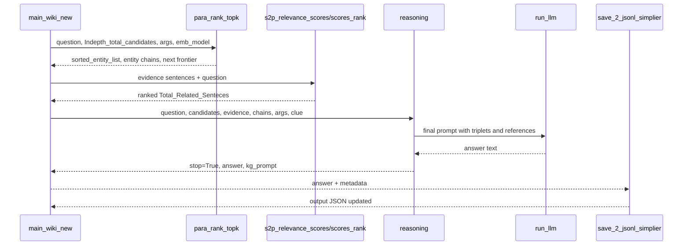

# Function Call Chain

This document traces one complete successful execution path for a single question through the ToG-2 pipeline. The path starts in `TOG_Original/ToG-2/main_tog2.py` and ends after final answer generation and output saving.

Assumed path:

- `args.self_consistency == True`, but the score is below the early-stop threshold.
- Topic entities exist.
- Topic pruning keeps at least one entity.
- Wikipedia retrieval succeeds.
- Relation pruning finds relations.
- Entity expansion finds candidates.
- Candidate ranking returns a non-empty frontier.
- `reasoning()` returns `stop=True`, so the answer is found before max depth fallback.

## Complete Call Chain

```mermaid
flowchart TD
    A["main_tog2.py top-level script"]
    B["prepare_dataset(args.dataset)"]
    C["MultiServerWikidataQueryClient(server_addrs)"]
    D["wiki_client.test_connections()"]
    E["self_consistency(query, data, i, args)"]
    F["run_llm(self-consistency prompt)"]
    G["main_wiki_new(query, topic_entity, ground_truth, data_point)"]
    H["topic_e_prune(question, topic_entity, args)"]
    I["run_llm_json(topic-prune prompt)"]
    J["get_wikipedia_page(wiki_client, topic entity)"]
    K["wiki_client.query_all('get_wikipedia_page', entity_dict)"]
    L["pages_embedding_search(question, related_passage, args, emb_model)"]
    M["relation_search(entity_id, entity_name, ...) or relation_search_prune(...)"]
    N["relation_prune_all(all_entity_relations, question, args)"]
    O["run_llm(relation-prune prompt)"]
    P["entity_search(entity_id, relation, wiki_client, head)"]
    Q["wiki_client.query_all('label2pid' / graph methods)"]
    R["get_wikipedia_page(wiki_client, candidate)"]
    S["pages_embedding_search_only_para(related_passage)"]
    T["update_history_find_entity(entity_candidates, relation, total_candidates)"]
    U["para_rank_topk(question, candidates, args, emb_model)"]
    V["s2p_relevance_scores(paragraphs, question, args, emb_model)"]
    W["scores_rank(scores, sentences)"]
    X["reasoning(original_question, candidates, sentences, chains, args, clue)"]
    Y["run_llm(final reasoning prompt)"]
    Z["extract_answer(response) / if_true(...) / contains_yes_regex(...)"]
    AA["save_2_jsonl_simplier(...)"]
    AB["Final answer saved"]

    A --> B --> C --> D --> E --> F --> G
    G --> H --> I --> J --> K --> L
    L --> M --> N --> O --> P --> Q --> R --> S --> T --> U --> V --> W --> X --> Y --> Z --> AA --> AB
```



## Linear View

```text
main_tog2.py top-level script
    ↓
prepare_dataset(args.dataset)
    ↓
MultiServerWikidataQueryClient(server_addrs)
    ↓
wiki_client.test_connections()
    ↓
self_consistency(query, data, i, args)
    ↓
run_llm(self-consistency prompt)
    ↓
main_wiki_new(query, topic_entity, ground_truth, data_point)
    ↓
topic_e_prune(question, topic_entity, args)
    ↓
run_llm_json(topic-prune prompt)
    ↓
get_wikipedia_page(wiki_client, topic entity)
    ↓
wiki_client.query_all("get_wikipedia_page", entity_dict)
    ↓
pages_embedding_search(question, related_passage, args, emb_model)
    ↓
relation_search(...) / relation_search_prune(...)
    ↓
relation_prune_all(...)
    ↓
run_llm(relation-prune prompt)
    ↓
entity_search(entity_id, relation, wiki_client, head)
    ↓
wiki_client.query_all("label2pid" / graph expansion methods)
    ↓
get_wikipedia_page(wiki_client, candidate)
    ↓
pages_embedding_search_only_para(related_passage)
    ↓
update_history_find_entity(...)
    ↓
para_rank_topk(question, Indepth_total_candidates, args, emb_model)
    ↓
s2p_relevance_scores(paragraphs, question, args, emb_model)
    ↓
scores_rank(scores, sentences)
    ↓
reasoning(original_question, candidates, sentences, chains, args, clue)
    ↓
run_llm(final reasoning prompt)
    ↓
extract_answer(response) / if_true(...) / contains_yes_regex(...)
    ↓
save_2_jsonl_simplier(...)
    ↓
final answer saved
```

## Function Details

| Function | File Name | Input | Output | Purpose |
|---|---|---|---|---|
| Top-level script body | `TOG_Original/ToG-2/main_tog2.py` | CLI arguments, dataset files, `server_urls.txt`. | Iterates over dataset samples and saves one result per question. | Orchestrates the full experiment run. |
| `prepare_dataset` | `TOG_Original/ToG-2/utils.py` | `args.dataset`. | `datas`, `question_string`. | Loads the selected benchmark JSON and identifies the question/claim field. |
| `MultiServerWikidataQueryClient.__init__` | `TOG_Original/ToG-2/client.py` | List of Wikidata XML-RPC server URLs. | Client object with one `WikidataQueryClient` per URL. | Creates the runtime KG client used for relation/entity/Wikipedia queries. |
| `test_connections` | `TOG_Original/ToG-2/client.py` | Existing client objects. | Filters `self.clients` to reachable servers or raises an exception. | Verifies Wikidata servers before graph traversal starts. |
| `self_consistency` | `TOG_Original/ToG-2/utils.py` | `question`, dataset record `data`, sample index `idx`, `args`. | Dataset record with `cot_sc_score`, `cot_sc_response`, `cot_sc_answer`. | Samples multiple LLM answers to estimate whether graph search can be skipped. |
| `run_llm` | `TOG_Original/ToG-2/utils.py` | Prompt, temperature, max tokens, API key, model name, optional `n`. | LLM text response, or full multi-choice response object when `n > 1`. | Calls OpenAI-compatible chat completion for self-consistency, pruning, reasoning, and fallback answers. |
| `main_wiki_new` | `TOG_Original/ToG-2/main_tog2.py` | `original_question`, `topic_entity`, `ground_truth`, `data_point`. | `answer`, `search_entity_list`, `Total_Related_Senteces`, `cluster_chain_of_entities`, `end_mode`, `remark`. | Processes one question through graph search, retrieval, ranking, reasoning, and fallback logic. |
| `topic_e_prune` | `TOG_Original/ToG-2/wiki_func.py` | `question`, initial topic entities, `args`. | Pruned topic entities. | Reduces noisy starting entities before graph expansion. |
| `run_llm_json` | `TOG_Original/ToG-2/wiki_func.py` | JSON prompt, temperature, max tokens, API key, `args`, model name. | JSON-formatted LLM response text. | Requests structured JSON output for pruning tasks. |
| `get_wikipedia_page` | `TOG_Original/ToG-2/wiki_func.py` | `wiki_client`, entity dictionary. | Wikipedia page text as a string. | Retrieves evidence text for a topic or candidate entity through the runtime client. |
| `query_all` | `TOG_Original/ToG-2/client.py` | Method name and method arguments. | Merged result from all reachable Wikidata servers. | Fan-out/fan-in wrapper for XML-RPC server calls. |
| `pages_embedding_search` | `TOG_Original/ToG-2/search.py` | `question`, raw page text, `args`, `emb_model`, `top_k`. | Best paragraph text and top sentence records. | Splits Wikipedia text and ranks paragraphs/sentences by relevance. |
| `relation_search` | `TOG_Original/ToG-2/wiki_func.py` | Entity QID/name, previous relation/head state, question, `args`, `wiki_client`. | Unscored relation records. | Collects available Wikidata relations for the current frontier entity. |
| `relation_search_prune` | `TOG_Original/ToG-2/wiki_func.py` | Entity QID/name, previous relation/head state, question, `args`, `wiki_client`. | Scored relation records. | Retrieves available relations and uses the LLM to keep the most useful ones. |
| `relation_prune_all` | `TOG_Original/ToG-2/wiki_func.py` | Relations grouped by entity, question, `args`. | Jointly pruned relation records. | Selects relevant relations across all current frontier entities. |
| `entity_search` | `TOG_Original/ToG-2/wiki_func.py` | Current entity QID, relation label, `wiki_client`, relation direction `head`. | Candidate entities or `[FINISH_ID]` literal-value candidates. | Expands graph neighbors through a selected Wikidata relation. |
| `pages_embedding_search_only_para` | `TOG_Original/ToG-2/search.py` | Raw candidate Wikipedia page text. | List of cleaned paragraphs. | Extracts candidate evidence paragraphs for later ranking. |
| `update_history_find_entity` | `TOG_Original/ToG-2/wiki_func.py` | Candidate entities, relation record, accumulated candidates. | Updated `Indepth_total_candidates`. | Attaches relation/path metadata to expanded entity candidates. |
| `para_rank_topk` | `TOG_Original/ToG-2/wiki_func.py` | Question, in-depth candidates, `args`, embedding model. | Ranking flag, entity chains, next QIDs, previous relations/heads, sorted candidates. | Scores candidate paragraphs and selects the next graph frontier. |
| `s2p_relevance_scores` | `TOG_Original/ToG-2/search.py` | Texts, question, `args`, embedding model. | Numeric relevance scores. | Dispatches to BGE, MiniLM, BM25, BGE reranker, or ColBERT scoring. |
| `scores_rank` | `TOG_Original/ToG-2/search.py` | Scores and text strings. | Sorted list of `{score, text}` records. | Orders evidence sentences by relevance before reasoning. |
| `reasoning` | `TOG_Original/ToG-2/wiki_func.py` | Original question, ranked candidates, evidence sentences, entity chains, `args`, clue. | `stop`, LLM `answer`, final prompt. | Builds a prompt from graph paths and retrieved references, then asks the LLM whether the answer is found. |
| `extract_answer` | `TOG_Original/ToG-2/utils.py` | LLM response text. | Text inside the first pair of braces, or empty string. | Parses the LLM stop/answer marker. |
| `if_true` | `TOG_Original/ToG-2/utils.py` | Parsed answer marker. | Boolean. | Converts a normalized `yes` marker into a stop decision. |
| `contains_yes_regex` | `TOG_Original/ToG-2/wiki_func.py` | LLM response text. | Boolean. | Detects `yes` in the first 100 words as an additional stop signal. |
| `save_2_jsonl_simplier` | `TOG_Original/ToG-2/search.py` | Question, ground truth, answer, search/evidence/path records, dataset, end mode, remark, `args`. | JSON result file updated on disk. | Saves the generated answer and run metadata for later evaluation. |

## Final Reasoning Subchain



## Final Answer Generation Point

In the successful path, the final answer is generated inside:

```text
wiki_func.reasoning(...)
    ↓
utils.run_llm(final_prompt, args.temperature_reasoning, args.max_length, args.opeani_api_keys, args.LLM_type)
```

The answer is then returned to `main_wiki_new`, which returns it to the top-level sample loop in `main_tog2.py`. The sample loop calls `search.save_2_jsonl_simplier(...)` to persist the result.

