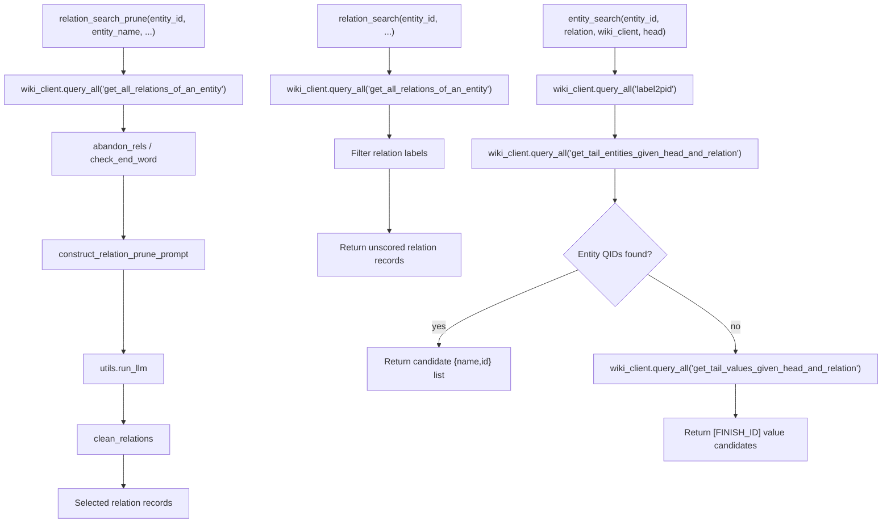
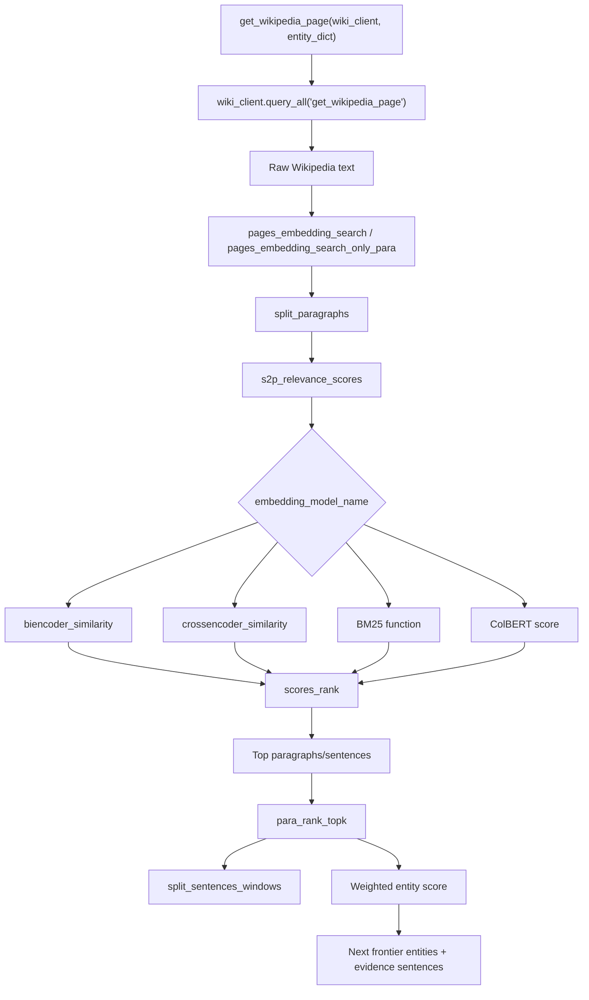
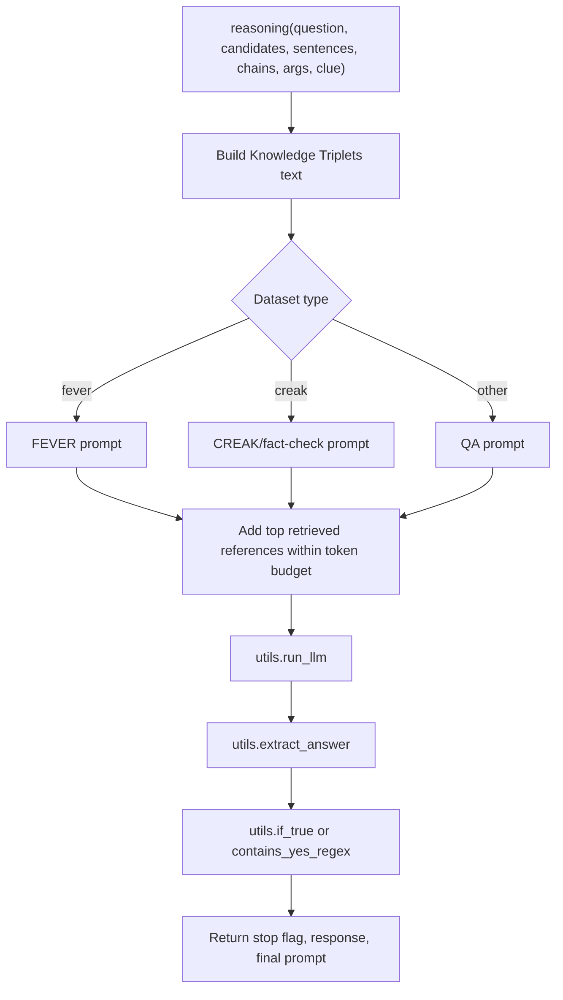
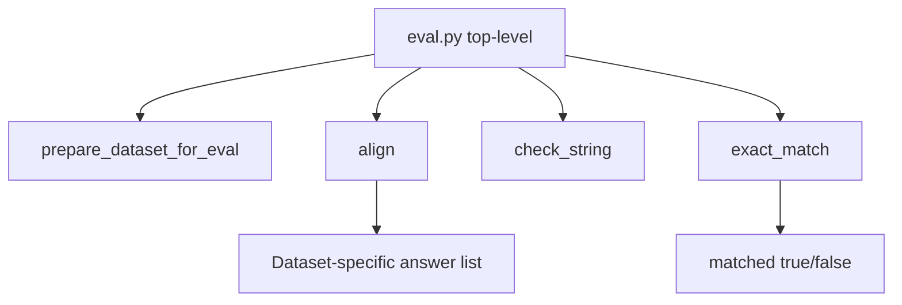

# Function Dependency

This document summarizes important function and class dependencies in `TOG_Original/`.

## Primary Call Graph

```mermaid
flowchart TD
    Script["main_tog2.py top-level"] --> Sliding["sliding_window_type"]
    Script --> Prep["utils.prepare_dataset"]
    Script --> ClientCtor["client.MultiServerWikidataQueryClient"]
    ClientCtor --> TestConn["MultiServerWikidataQueryClient.test_connections"]
    Script --> SelfC["utils.self_consistency"]
    Script --> MainWiki["main_wiki_new"]
    Script --> SaveSimple["search.save_2_jsonl_simplier"]

    SelfC --> RunLLM["utils.run_llm"]

    MainWiki --> GenerateGPT["utils.generate_only_with_gpt"]
    MainWiki --> TopicPrune["wiki_func.topic_e_prune"]
    MainWiki --> GetWiki["wiki_func.get_wikipedia_page"]
    MainWiki --> PageSearch["search.pages_embedding_search"]
    MainWiki --> RelationSearch["wiki_func.relation_search"]
    MainWiki --> RelationPrune["wiki_func.relation_search_prune"]
    MainWiki --> RelationPruneAll["wiki_func.relation_prune_all"]
    MainWiki --> EntitySearch["wiki_func.entity_search"]
    MainWiki --> ParaOnly["search.pages_embedding_search_only_para"]
    MainWiki --> UpdateHist["wiki_func.update_history_find_entity"]
    MainWiki --> RankTopK["wiki_func.para_rank_topk"]
    MainWiki --> Scores["search.s2p_relevance_scores"]
    MainWiki --> ScoreRank["search.scores_rank"]
    MainWiki --> Reasoning["wiki_func.reasoning"]
    MainWiki --> Finish["utils.if_finish_list"]

    TopicPrune --> RunJSON["wiki_func.run_llm_json"]
    RelationPrune --> RunLLM
    RelationPruneAll --> RunLLM
    Reasoning --> RunLLM
    GenerateGPT --> RunLLM
```



## Graph Search Function Flow



## Evidence Ranking Function Flow



## Reasoning Function Flow



## Main Functions By File

### `ToG-2/main_tog2.py`

| Function | Calls / Uses | Purpose |
|---|---|---|
| `sliding_window_type` | `argparse.ArgumentTypeError` | Parses positional `window_size,step_size` CLI input. |
| `main_wiki_new` | Most pipeline helpers in `utils.py`, `search.py`, `wiki_func.py`, `wiki_client` | Runs one question through self-consistency fallback, topic pruning, graph expansion, evidence retrieval/ranking, and LLM reasoning. |

### `ToG-2/client.py`

| Function / Class | Calls / Uses | Purpose |
|---|---|---|
| `format_entity_name_for_wikipedia` | string replacement | Converts entity labels to Wikipedia URL titles. |
| `WikidataQueryClient` | `xmlrpc.client.ServerProxy`, `requests`, `BeautifulSoup` | Single-server XML-RPC and Wikipedia client. |
| `WikidataQueryClient.label2qid` | remote `label2qid` | Entity label to QID lookup. |
| `WikidataQueryClient.label2pid` | remote `label2pid` | Relation label to PID lookup. |
| `WikidataQueryClient.pid2label` | remote `pid2label` | PID to label lookup. |
| `WikidataQueryClient.qid2label` | remote `qid2label` | QID to label lookup. |
| `WikidataQueryClient.get_all_relations_of_an_entity` | remote method | Retrieves incoming/outgoing relations. |
| `WikidataQueryClient.get_tail_entities_given_head_and_relation` | remote method | Retrieves graph neighbor entities. |
| `WikidataQueryClient.get_tail_values_given_head_and_relation` | remote method | Retrieves literal values for relation edges. |
| `WikidataQueryClient.get_external_id_given_head_and_relation` | remote method | Retrieves external IDs. |
| `WikidataQueryClient.get_wikipedia_page` | Wikipedia HTTP, optional remote `get_wikipedia_link` | Downloads and cleans Wikipedia summary/section text. |
| `WikidataQueryClient.mid2qid` | remote `mid2qid` | Freebase MID to Wikidata QID lookup. |
| `MultiServerWikidataQueryClient.test_connections` | XML-RPC introspection | Filters unreachable servers. |
| `MultiServerWikidataQueryClient.query_all` | thread pool, client method names | Queries all working servers and merges results. |

### `ToG-2/utils.py`

| Function | Calls / Uses | Purpose |
|---|---|---|
| `retrieve_top_docs` | embedding model, `sentence_transformers.util.dot_score` | Ranks documents by vector similarity. |
| `compute_bm25_similarity` | `BM25Okapi` | Scores corpus by lexical BM25 relevance. |
| `if_all_zero` | none | Detects all-zero score lists. |
| `clean_relations_bm25_sent` | `if_all_zero` | Converts BM25 relation ranking into structured relation records. |
| `run_llm` | `openai.OpenAI` or local OpenAI-compatible server | General chat-completion wrapper with retries. |
| `run_llm_cnfin` | `openai.OpenAI` | Chinese finance-specific LLM wrapper. |
| `all_unknown_entity`, `del_unknown_entity` | none | Cleans unknown entity placeholders. |
| `clean_scores` | `re.findall` | Parses LLM-produced numeric scores. |
| `save_2_jsonl` | `json`, `os.path.exists` | Writes richer output JSON array. |
| `extract_answer` | string search | Extracts text inside braces. |
| `if_true` | string normalization | Parses exact yes responses. |
| `generate_without_explored_paths` | `run_llm` | LLM-only CoT answer. |
| `generate_only_with_sentences` | `run_llm` | LLM answer using retrieved sentences. |
| `query_reformulate_clue`, `query_reformulate_add` | regex, `run_llm` | Reformulates/augments query from clue markers. |
| `dynamic_requery_fin` | string matching | Selects finance search mode from generated answer text. |
| `generate_only_with_gpt` | `run_llm`, prompt templates | Dataset-aware LLM-only fallback. |
| `self_consistency` | nested prompt/vote helpers, `run_llm` | Samples multiple LLM answers and stores agreement score. |
| `if_finish_list` | none | Removes `[FINISH_ID]` markers or signals traversal finish. |
| `prepare_dataset` | `json.load` | Loads selected benchmark data and returns the question key. |

### `ToG-2/search.py`

| Function | Calls / Uses | Purpose |
|---|---|---|
| `scores_rank` | sorting | Converts scores/texts into sorted evidence records. |
| `crossencoder_similarity` | cross-encoder/reranker model | Scores question-text pairs. |
| `biencoder_similarity` | BGE bi-encoder model | Scores question and passages with matrix multiplication. |
| `s2p_relevance_scores` | selected ranker | Dispatches to BGE, cross-encoder, BM25, or ColBERT scoring. |
| `split_paragraphs` | regex, line filtering | Extracts useful Wikipedia paragraphs. |
| `split_sentences_1`, `split_sentences` | regex | Splits text into simple sentence lists. |
| `split_sentences_windows` | `blingfire.text_to_sentences_and_offsets` | Builds sentence windows for retrieval. |
| `pages_embedding_search` | `split_paragraphs`, `s2p_relevance_scores`, `scores_rank`, `split_sentences_windows` | Returns best paragraph text and top ranked sentences. |
| `pages_embedding_search_only_para` | `split_paragraphs` | Returns paragraphs without scoring. |
| `save_2_jsonl_simplier` | `json`, `os.path.exists` | Appends compact result records using a parameterized filename. |

### `ToG-2/wiki_func.py`

| Function | Calls / Uses | Purpose |
|---|---|---|
| `transform_relation` | string replacement | Normalizes relation labels. |
| `clean_relations` | regex, `transform_relation` | Parses relation-pruning LLM output. |
| `clean_relation_all_e` | regex, `transform_relation` | Parses joint relation-pruning output. |
| `construct_all_relation_prune_prompt` | prompt templates | Builds joint relation-pruning prompt. |
| `construct_relation_prune_prompt` | prompt templates | Builds per-entity relation-pruning prompt. |
| `check_end_word`, `abandon_rels` | string rules | Filters unhelpful Wikidata relations. |
| `construct_entity_score_prompt0`, `construct_entity_find_prompt` | prompt templates | Builds entity scoring/finding prompts. |
| `relation_prune_all` | `run_llm`, `clean_relation_all_e` | Jointly prunes relations across entities. |
| `relation_search_prune` | `wiki_client.query_all`, `abandon_rels`, `run_llm`, `clean_relations` | Searches and LLM-prunes relations for one entity. |
| `relation_search_prune_fin` | `run_llm_json` | Finance-specific relation pruning. |
| `relation_search` | `wiki_client.query_all`, `abandon_rels` | Retrieves unpruned relation records. |
| `run_llm_json` | `openai.OpenAI` | JSON-mode LLM wrapper. |
| `topic_e_prune` | nested prompt helpers, `run_llm_json` | Prunes initial topic entities. |
| `entity_search` | `wiki_client.query_all` | Expands a Wikidata entity through a relation. |
| `entity_search_fin` | finance DB client | Finance-specific graph expansion. |
| `entity_find`, `match_top2_entities` | `run_llm`, regex | Optionally selects top matching entity candidates. |
| `contains_yes_regex` | regex | Detects yes in the beginning of LLM response. |
| `update_history_find_entity` | none | Adds relation/path metadata to entity candidates. |
| `para_rank_topk`, `para_rank_topk_fin` | `s2p_relevance_scores`, `split_sentences_windows`/`split_sentences` | Ranks candidates by paragraph relevance and returns next frontier. |
| `question_clearify` | `run_llm`, `extract_answer` | Rewrites unclear questions with clues. |
| `reasoning`, `reasoning_fin` | prompt templates, `run_llm`, `extract_answer`, `contains_yes_regex` | Builds final reasoning prompts and returns a stop decision. |
| `get_wikipedia_page` | `wiki_client.query_all` | Retrieves and optionally caches Wikipedia page text for an entity. |

## Evaluation Call Graph



## Wikidata Server Call Graph

```mermaid
flowchart TD
    PreMain["preprocess_dump.main"] --> Count["reader_process.count_lines"]
    PreMain --> Read["reader_process.read_data"]
    PreMain --> Process["worker_process.process_data"]
    PreMain --> Write["writer_process.write_data"]
    Process --> ProcessJSON["worker_process.process_json"]
    ProcessJSON --> MainSnak["worker_process.process_mainsnak"]
    Write --> Writer["Writer.write"]
    Writer --> TableWrite["Table.write"]

    BuildMain["build_index.main"] --> ReadEnt["read_entity_label"]
    BuildMain --> ReadRel["read_relation_label"]
    BuildMain --> ReadRelEnt["read_relation_entities"]
    BuildMain --> ReadVal["read_tail_values"]
    BuildMain --> ReadExt["read_external_ids"]
    BuildMain --> Pickles["pickle.dump indices"]

    ServerCtor["XMLRPCWikidataQueryServer.__init__"] --> BaseCtor["WikidataQueryServer.__init__"]
    BaseCtor --> Labels["read labels and pickle indices"]
    ServerCtor --> Register["register XML-RPC functions"]
    Register --> Label2QID["label2qid"]
    Register --> Label2PID["label2pid"]
    Register --> QID2Label["qid2label"]
    Register --> PID2Label["pid2label"]
    Register --> GetRels["get_all_relations_of_an_entity"]
    Register --> GetTail["get_tail_entities_given_head_and_relation"]
    Register --> GetValues["get_tail_values_given_head_and_relation"]
    Register --> GetExt["get_external_id_given_head_and_relation"]
```



## Key Stop And Fallback Functions

```mermaid
flowchart TD
    A["main_wiki_new"] --> B{"Condition"}
    B -->|High self-consistency| C["Return data_point['cot_sc_response']"]
    B -->|No topic entity| D["generate_only_with_gpt"]
    B -->|No relation at depth 1| D
    B -->|No candidates| D
    B -->|All [FINISH_ID]| D
    B -->|Depth exhausted| D
    B -->|Reasoning returns stop=True| E["Return reasoning answer"]
```

