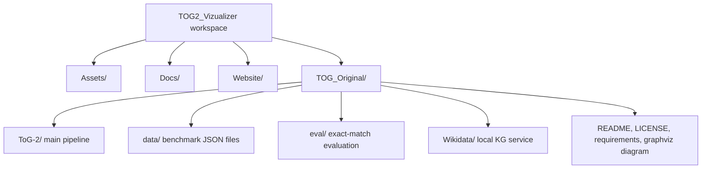
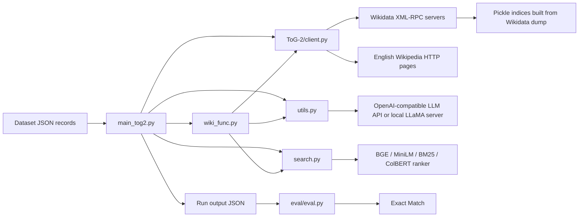

# Repository Overview

This repository contains the original Think-on-Graph 2.0 (ToG-2) research code under `TOG_Original/`. The main application is a knowledge-guided retrieval augmented generation pipeline: it starts from dataset questions and linked Wikidata topic entities, expands a Wikidata graph, retrieves Wikipedia evidence for candidate entities, ranks evidence, asks an LLM to reason over graph paths and retrieved text, and saves model answers for later evaluation.

## Entry Point

The primary runtime entry point is:

```bash
cd TOG_Original/ToG-2
python main_tog2.py --dataset hotpot_e --max_length 256 ...
```

Support entry points:

- `TOG_Original/Wikidata/simple_wikidata_db/preprocess_dump.py`: preprocesses a Wikidata JSON dump into JSONL table shards.
- `TOG_Original/Wikidata/simple_wikidata_db/db_deploy/build_index.py`: builds pickle indices used by the Wikidata XML-RPC servers.
- `TOG_Original/Wikidata/simple_wikidata_db/db_deploy/server.py`: starts one XML-RPC Wikidata query server chunk.
- `TOG_Original/eval/eval.py`: evaluates saved ToG-2 outputs with exact match.

## Top-Level Structure



Only `TOG_Original/` contains executable project code in the files currently present.

## Major Files And Directories

| Path | Purpose |
|---|---|
| `TOG_Original/README.md` | Main project documentation: setup, run commands, evaluation command, citation. |
| `TOG_Original/requirements.txt` | Python dependencies for the ToG-2 pipeline. |
| `TOG_Original/LICENSE` | Apache 2.0 license. |
| `TOG_Original/tog2_core.gv` | Graphviz source describing the ToG-2 core flow. |
| `TOG_Original/tog2_core.png` | Rendered image of the core flow graph. |
| `TOG_Original/data/*.json` | Benchmark datasets and entity-linked dataset variants. Runtime loaders expect several additional optional datasets that are not all present here. |
| `TOG_Original/ToG-2/main_tog2.py` | Primary CLI entry point. Parses arguments, loads data/model/client, runs `main_wiki_new` per sample, saves outputs. |
| `TOG_Original/ToG-2/client.py` | Client-side Wikidata XML-RPC and Wikipedia retrieval wrapper. Defines single-server and multi-server clients. |
| `TOG_Original/ToG-2/utils.py` | Dataset loading, LLM calls, self-consistency, fallback answer generation, output helpers, answer parsing. |
| `TOG_Original/ToG-2/search.py` | Passage splitting, sentence/window generation, embedding/BM25 scoring, evidence ranking, simple JSON output writing. |
| `TOG_Original/ToG-2/wiki_func.py` | Graph-search logic: relation pruning, topic pruning, entity expansion, candidate ranking, final reasoning prompts. |
| `TOG_Original/ToG-2/prompt_list.py` | Prompt template library used by `utils.py` and `wiki_func.py`. |
| `TOG_Original/ToG-2/ner.py` | Optional Azure entity-linking helpers and entity-cache loader. Not used directly by `main_tog2.py` in the current code path. |
| `TOG_Original/ToG-2/server_urls.txt` | Runtime list of Wikidata XML-RPC server URLs. |
| `TOG_Original/eval/eval.py` | CLI evaluator that loads an output JSON and computes exact match against source data. |
| `TOG_Original/eval/utils.py` | Evaluation dataset loading, answer alignment, answer normalization, exact-match helpers. |
| `TOG_Original/Wikidata/README.md` | Setup instructions for the local Wikidata service. |
| `TOG_Original/Wikidata/requirements.txt` | Dependencies for Wikidata preprocessing/index/server tooling. |
| `TOG_Original/Wikidata/scripts/build_index.sh` | Shell wrapper for building Wikidata indices. |
| `TOG_Original/Wikidata/scripts/start_server.sh` | Shell wrapper for launching XML-RPC query servers. |
| `TOG_Original/Wikidata/simple_wikidata_db/preprocess_dump.py` | Multiprocess dump preprocessor orchestration. |
| `TOG_Original/Wikidata/simple_wikidata_db/preprocess_utils/reader_process.py` | Reads gzipped Wikidata dump lines into queues. |
| `TOG_Original/Wikidata/simple_wikidata_db/preprocess_utils/worker_process.py` | Parses Wikidata JSON entities into normalized output tables. |
| `TOG_Original/Wikidata/simple_wikidata_db/preprocess_utils/writer_process.py` | Writes normalized JSONL table shards. |
| `TOG_Original/Wikidata/simple_wikidata_db/db_deploy/build_index.py` | Builds relation/entity/value/external-id indices from preprocessed shards. |
| `TOG_Original/Wikidata/simple_wikidata_db/db_deploy/server.py` | Loads labels and pickle indices, exposes XML-RPC KG query methods. |
| `TOG_Original/Wikidata/simple_wikidata_db/db_deploy/client.py` | Standalone XML-RPC client mirroring the ToG-2 runtime client without Wikipedia retrieval. |
| `TOG_Original/Wikidata/simple_wikidata_db/db_deploy/utils.py` | Dataclasses and JSONL/batch-file readers used by deploy tooling. |
| `TOG_Original/Wikidata/simple_wikidata_db/utils.py` | Generic JSONL, batching, append, and directory helpers for preprocessing. |

## System Architecture



## Runtime Responsibilities

1. `main_tog2.py` reads CLI arguments and dataset records.
2. `utils.prepare_dataset` selects the correct data file and question field.
3. `main_tog2.py` loads an embedding/reranking model.
4. `client.MultiServerWikidataQueryClient` connects to one or more Wikidata XML-RPC servers.
5. `main_wiki_new` processes each question:
   - optionally runs self-consistency via LLM,
   - optionally prunes topic entities,
   - retrieves Wikipedia evidence for current entities,
   - expands Wikidata relations and neighbor entities,
   - ranks candidate paragraphs/sentences,
   - calls LLM reasoning,
   - stops early when evidence is sufficient or falls back to LLM-only generation.
6. `search.save_2_jsonl_simplier` appends result records.
7. `eval/eval.py` can later compare generated answers with dataset answers.

## External Services And Assets

- Wikidata XML-RPC servers must be running and listed in `ToG_Original/ToG-2/server_urls.txt`.
- Wikipedia pages are fetched over HTTP by `ToG-2/client.py`.
- LLM calls use `openai.OpenAI` against a configured API base or local OpenAI-compatible LLaMA endpoint.
- Ranking models are loaded from packages such as `FlagEmbedding` or `sentence_transformers`, depending on `--embedding_model_name`.
- Azure Text Analytics is only used by optional `ner.py` helpers.

