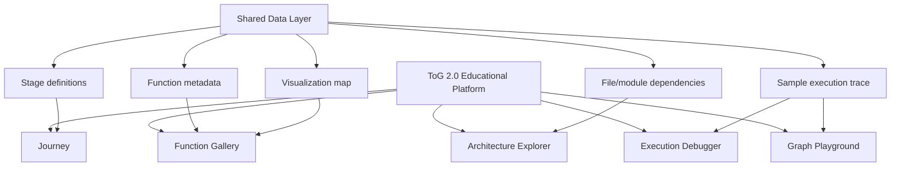

# Website Specification

This specification describes a React + TypeScript educational platform for explaining and exploring Think-on-Graph 2.0 (ToG-2). The site should teach the runtime journey of a single question, reveal architecture and function dependencies, and provide interactive visualizations for graph traversal, evidence retrieval, ranking, and reasoning.

The platform is documentation-driven: it can start from static JSON/Markdown-derived data and later connect to real trace logs from a ToG-2 run.

## Product Goals

- Make the ToG-2 pipeline understandable without reading source code first.
- Show how one question moves through self-consistency, topic pruning, Wikipedia retrieval, embedding search, relation pruning, entity expansion, candidate ranking, reasoning, and answer generation.
- Help users inspect architecture, dependencies, function calls, and runtime state.
- Provide interactive diagrams and playground views for education, debugging, and future demos.

## Recommended Stack

| Area | Recommendation |
|---|---|
| Framework | React + TypeScript, preferably Vite for a lightweight educational app |
| Routing | `react-router-dom` |
| Diagrams | Mermaid rendering through `mermaid` or React wrapper |
| Graph Visualization | `reactflow` for node/edge graphs |
| Charts | `recharts` for scores, confidence, ranking, and distribution views |
| Tables | `@tanstack/react-table` for function and file inventory tables |
| State | Zustand for UI/session state; static data imported as JSON or TypeScript constants |
| Code/Prompt Display | `react-syntax-highlighter` or Shiki |
| Markdown | `react-markdown` with `remark-gfm` for docs-style content |
| Icons | `lucide-react` |
| Styling | Tailwind CSS or CSS modules with design tokens |
| Testing Later | Vitest + React Testing Library; Playwright for visual flows |

## Information Architecture



## Global App Structure

### Core Layout

- Persistent left navigation with the five pages.
- Top bar with current page title, dataset/sample selector, and trace mode selector.
- Main content area optimized for dense technical inspection.
- Optional right inspector panel for selected node/function/stage details.

### Global React Component Tree

```text
App
  BrowserRouter
    AppShell
      SidebarNav
      TopBar
        DatasetSelector
        TraceSelector
      MainRoutes
        JourneyPage
        ArchitectureExplorerPage
        ExecutionDebuggerPage
        GraphPlaygroundPage
        FunctionGalleryPage
      InspectorDrawer
      ToastRegion
```

### Shared Data Structures

```ts
type StageId =
  | "self_consistency"
  | "topic_pruning"
  | "wikipedia_retrieval"
  | "embedding_search"
  | "relation_pruning"
  | "entity_expansion"
  | "candidate_ranking"
  | "reasoning"
  | "answer_generation";

type StageSpec = {
  id: StageId;
  name: string;
  purpose: string;
  inputs: string[];
  outputs: string[];
  functions: string[];
  files: string[];
  runtimeVariables: string[];
  failureCases: string[];
  visualizationType: string;
};

type FunctionSpec = {
  name: string;
  file: string;
  purpose: string;
  inputs: string[];
  outputs: string[];
  calledBy: string[];
  calls: string[];
  visualizationType: string;
  stageIds: StageId[];
};

type FileSpec = {
  path: string;
  role: string;
  imports: string[];
  usedBy: string[];
  majorFunctions: string[];
};

type TraceEvent = {
  id: string;
  stageId: StageId;
  functionName: string;
  file: string;
  timestamp?: number;
  status: "pending" | "running" | "success" | "fallback" | "error";
  input: unknown;
  output: unknown;
  runtimeVariables: Record<string, unknown>;
  logs?: string[];
  error?: string;
};

type GraphNode = {
  id: string;
  label: string;
  qid?: string;
  type: "topic" | "candidate" | "selected" | "finish" | "discarded";
  score?: number;
  metadata?: Record<string, unknown>;
};

type GraphEdge = {
  id: string;
  source: string;
  target: string;
  relation: string;
  score?: number;
  direction: "head" | "tail";
};
```

## Page 1: Journey

### Purpose

The Journey page teaches the full ToG-2 process as a guided story. A user should be able to follow one question from input dataset record to final answer, seeing the purpose and outcome of each major stage.

### Components

| Component | Purpose |
|---|---|
| `JourneyTimeline` | Vertical or horizontal stage timeline for the nine major stages. |
| `StageCard` | Displays purpose, input, output, functions, variables, and failure cases for one stage. |
| `QuestionRunHeader` | Shows selected question, dataset, topic entities, and final answer summary. |
| `StageTransitionDiagram` | Mermaid or custom diagram showing movement from one stage to the next. |
| `EvidencePreview` | Shows top retrieved evidence sentences for the currently selected stage. |
| `DecisionBadge` | Shows decisions such as “continue graph search”, “fallback”, or “answer found”. |
| `FailureCasePanel` | Lists common ways the selected stage can fail. |

### UI Layout

- Top: compact run header with question, dataset, selected model, width, depth, and answer.
- Left: sticky stage timeline.
- Center: selected stage explanation and stage transition diagram.
- Right: runtime variables, inputs/outputs, and failure cases.
- Bottom: evidence/path strip that updates as the stage changes.

### Data Structure

```ts
type JourneyPageData = {
  runSummary: {
    question: string;
    dataset: string;
    topicEntities: Array<{ qid: string; label: string }>;
    finalAnswer: string;
    endMode: string;
    remark: string;
  };
  stages: StageSpec[];
  traceEvents: TraceEvent[];
  evidence: Array<{ text: string; score: number; entity?: string }>;
};
```

### React Component Tree

```text
JourneyPage
  QuestionRunHeader
  JourneyLayout
    JourneyTimeline
      StageTimelineItem
    StageDetailPanel
      StageCard
      StageTransitionDiagram
      FunctionChips
      FileChips
    RuntimeInspector
      InputOutputTabs
      RuntimeVariableTable
      FailureCasePanel
    EvidencePreview
```

### Required Libraries

- `react-router-dom`
- `mermaid`
- `lucide-react`
- `@tanstack/react-table`
- `react-syntax-highlighter` or Shiki

### Future Enhancements

- Playback mode that animates stage progression.
- Import real trace JSON from an actual ToG-2 run.
- Side-by-side comparison of successful path vs fallback path.
- Dataset-specific journey variants for HotpotQA, FEVER, CREAK, and WebQSP.

## Page 2: Architecture Explorer

### Purpose

The Architecture Explorer shows how files, modules, external services, and data sources connect. It should help users understand the system before diving into individual functions.

### Components

| Component | Purpose |
|---|---|
| `ArchitectureGraph` | Interactive module/file dependency graph. |
| `ModuleInspector` | Shows selected file purpose, imports, used-by list, and major functions. |
| `ExternalServicePanel` | Explains Wikidata XML-RPC, Wikipedia HTTP, OpenAI-compatible LLM API, Azure optional NER. |
| `DataFlowDiagram` | Shows dataset → graph expansion → evidence → LLM → output. |
| `DependencyFilterBar` | Filters by runtime, evaluation, Wikidata tooling, data, external service. |
| `MermaidArchitectureView` | Static architecture diagram for easy reading/export. |

### UI Layout

- Top: dependency filter bar and graph mode selector.
- Main left: large interactive dependency graph.
- Main right: selected module inspector.
- Bottom: data-flow diagram and external service summary.

### Data Structure

```ts
type ArchitecturePageData = {
  files: FileSpec[];
  moduleEdges: Array<{
    source: string;
    target: string;
    type: "import" | "runtime_call" | "data_read" | "external_call";
  }>;
  externalServices: Array<{
    name: string;
    purpose: string;
    usedBy: string[];
    failureModes: string[];
  }>;
};
```

### React Component Tree

```text
ArchitectureExplorerPage
  DependencyFilterBar
  SplitPane
    ArchitectureGraph
      ReactFlowProvider
      ModuleNode
      DependencyEdge
    ModuleInspector
      FileSummary
      ImportList
      FunctionList
      ExternalCallsList
  DataFlowDiagram
  ExternalServicePanel
```

### Required Libraries

- `reactflow`
- `mermaid`
- `@tanstack/react-table`
- `lucide-react`

### Future Enhancements

- Toggle between file-level and function-level dependency graphs.
- Highlight the active runtime path for a selected trace event.
- Add source snippets for selected functions.
- Export architecture graph as SVG or PNG.

## Page 3: Execution Debugger

### Purpose

The Execution Debugger presents a trace-like view of one ToG-2 run. It should let users inspect each function call, input, output, runtime variables, logs, and failure/fallback conditions.

### Components

| Component | Purpose |
|---|---|
| `TraceTimeline` | Ordered list of runtime events and statuses. |
| `FunctionCallStack` | Shows nested function calls for the selected event. |
| `InputOutputViewer` | Displays structured input and output payloads. |
| `RuntimeVariableInspector` | Shows values such as `topic_entity`, `current_entity_relations_list`, `Indepth_total_candidates`, `Total_Related_Senteces`. |
| `PromptViewer` | Shows prompts sent to the LLM and responses returned. |
| `FallbackDetector` | Highlights when execution switches to `generate_only_with_gpt`. |
| `TraceSearch` | Filters trace events by function, file, stage, or status. |

### UI Layout

- Top: trace controls, selected question, run status, and filter input.
- Left: trace timeline with status indicators.
- Center: function call stack and event explanation.
- Right: input/output JSON tabs and runtime variables.
- Bottom: prompt/response viewer for LLM-related events.

### Data Structure

```ts
type ExecutionDebuggerData = {
  trace: TraceEvent[];
  callChain: Array<{
    functionName: string;
    file: string;
    depth: number;
    eventId: string;
  }>;
  prompts: Array<{
    eventId: string;
    promptType: "self_consistency" | "topic_prune" | "relation_prune" | "reasoning" | "fallback";
    prompt: string;
    response: string;
    parsedOutput?: unknown;
  }>;
};
```

### React Component Tree

```text
ExecutionDebuggerPage
  TraceToolbar
    TraceSearch
    StatusFilter
    StageFilter
  DebuggerGrid
    TraceTimeline
      TraceEventRow
    EventDetail
      FunctionCallStack
      EventPurposeCard
      FallbackDetector
    EventInspector
      InputOutputViewer
      RuntimeVariableInspector
  PromptViewer
```

### Required Libraries

- `@tanstack/react-table`
- `react-syntax-highlighter` or Shiki
- Zustand
- `lucide-react`

### Future Enhancements

- Live execution mode backed by instrumented Python logs.
- Diff two runs with different `width`, `depth`, or embedding model.
- Error replay for failed Wikidata or LLM calls.
- Copyable bug report for selected trace event.

## Page 4: Graph Playground

### Purpose

The Graph Playground lets users interactively explore the graph traversal part of ToG-2: topic entities, relation pruning, entity expansion, candidate ranking, and frontier updates.

### Components

| Component | Purpose |
|---|---|
| `KnowledgeGraphCanvas` | Interactive graph of topic entities, candidate entities, relations, and selected paths. |
| `TraversalControls` | Step through depth 1..N and play/pause traversal animation. |
| `RelationPruningPanel` | Shows available vs selected relations with scores and reasons. |
| `CandidateRankingPanel` | Shows candidate paragraph/entity scores. |
| `EvidenceDrawer` | Displays Wikipedia paragraphs/sentences for selected node. |
| `FrontierTracker` | Shows current frontier and next-hop selected entities. |
| `GraphLegend` | Explains topic, candidate, selected, discarded, and finish nodes. |

### UI Layout

- Top: question and traversal controls.
- Main center: full interactive graph canvas.
- Left: frontier tracker and relation pruning panel.
- Right: selected node/edge inspector and evidence drawer.
- Bottom: candidate ranking bars and depth progress indicator.

### Data Structure

```ts
type GraphPlaygroundData = {
  question: string;
  depthFrames: Array<{
    depth: number;
    frontier: string[];
    nodes: GraphNode[];
    edges: GraphEdge[];
    relationCandidates: Array<{
      entityId: string;
      entityName: string;
      relation: string;
      score?: number;
      selected: boolean;
      head: boolean;
    }>;
    candidateRankings: Array<{
      entityId: string;
      entityName: string;
      score: number;
      relation: string;
      evidence: Array<{ text: string; score: number }>;
    }>;
  }>;
};
```

### React Component Tree

```text
GraphPlaygroundPage
  GraphRunHeader
  GraphWorkspace
    LeftPanel
      FrontierTracker
      RelationPruningPanel
    KnowledgeGraphCanvas
      ReactFlowProvider
      EntityNode
      RelationEdge
      GraphLegend
    RightPanel
      NodeInspector
      EdgeInspector
      EvidenceDrawer
  TraversalControls
  CandidateRankingPanel
```

### Required Libraries

- `reactflow`
- `recharts`
- Zustand
- `lucide-react`

### Future Enhancements

- Let users manually choose relations and compare with LLM pruning.
- Add “what if width/depth changes?” simulation mode.
- Animate Wikipedia retrieval as evidence entering graph nodes.
- Export graph state for teaching slides.

## Page 5: Function Gallery

### Purpose

The Function Gallery is a searchable catalog of important ToG-2 functions. It should connect each function to purpose, file, stage, inputs, outputs, dependencies, and best visualization type.

### Components

| Component | Purpose |
|---|---|
| `FunctionSearchBar` | Search by name, file, stage, or visualization type. |
| `FunctionTable` | Dense table of function metadata. |
| `FunctionDetailDrawer` | Shows selected function details, dependencies, and related stages. |
| `VisualizationTypeBadge` | Shows recommended visualization pattern. |
| `FunctionCallDiagram` | Mermaid or React Flow diagram of called/calling functions. |
| `StageFilterTabs` | Filters functions by pipeline stage. |
| `FileFilterMenu` | Filters by source file. |

### UI Layout

- Top: search, stage tabs, and file filter.
- Main: sortable table of functions.
- Right drawer or lower panel: selected function detail.
- Optional bottom: function call diagram for selected function.

### Data Structure

```ts
type FunctionGalleryData = {
  functions: FunctionSpec[];
  stages: StageSpec[];
  visualizationTypes: Array<{
    id: string;
    label: string;
    description: string;
    exampleFunctions: string[];
  }>;
};
```

### React Component Tree

```text
FunctionGalleryPage
  FunctionGalleryToolbar
    FunctionSearchBar
    StageFilterTabs
    FileFilterMenu
  FunctionTable
    FunctionTableRow
    VisualizationTypeBadge
  FunctionDetailDrawer
    FunctionSummary
    InputOutputList
    RelatedStages
    CalledByList
    CallsList
    FunctionCallDiagram
```

### Required Libraries

- `@tanstack/react-table`
- `mermaid`
- `reactflow` for optional dependency graphs
- `lucide-react`

### Future Enhancements

- Link each function to source-code snippets.
- Add “learning path” filters such as beginner, graph search, LLM prompts, ranking, evaluation.
- Generate quizzes from function metadata.
- Add side-by-side comparison of similar functions, such as `relation_search` vs `relation_search_prune`.

## Shared UX Guidelines

- Keep pages dense but readable; this is a technical educational tool, not a marketing site.
- Prefer tables, diagrams, inspectors, and graph canvases over explanatory hero sections.
- Use consistent stage colors across all pages.
- Every selected function/stage/node should reveal inputs, outputs, purpose, and failure cases.
- Make Mermaid diagrams copyable or exportable.
- Keep the first screen useful: show the actual Journey or Explorer UI immediately.

## Suggested Static Data Files

The first implementation can use static data extracted from the generated docs:

| File | Purpose |
|---|---|
| `src/data/stages.ts` | Stage specs from `TOG_COMPONENTS.md`. |
| `src/data/functions.ts` | Function metadata from `FUNCTION_DEPENDENCY.md` and `TOG_VISUALIZATION_MAP.md`. |
| `src/data/files.ts` | File/module metadata from `FILE_DEPENDENCY.md`. |
| `src/data/sampleTrace.ts` | One mocked successful execution path from `FUNCTION_CALL_CHAIN.md`. |
| `src/data/architecture.ts` | Module graph edges and external service definitions. |

## MVP Scope

1. Build the global app shell and navigation.
2. Implement Journey with static stage data.
3. Implement Function Gallery with searchable table.
4. Implement Architecture Explorer with file-level graph.
5. Add Execution Debugger with mocked trace data.
6. Add Graph Playground with one static depth-by-depth graph.

## Future Platform Enhancements

- Python-side trace exporter that records real `main_wiki_new` execution events.
- Upload trace JSON files into the browser.
- Compare multiple traces from different model/ranker/depth settings.
- Add notebook-style explanations for teaching.
- Add export to PNG/SVG/PDF for diagrams and graph states.
- Add a guided “build your own ToG run” tutorial mode.

